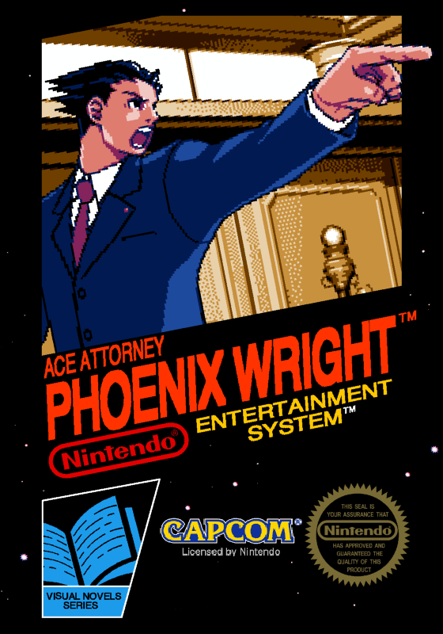

# Phoenix Wright: Ace attorney - NES Demake

<div align="center">
  
</div>

## Table of Contents

+ [About The Project](#about-the-project)
+ [Compile](#compile)
  + [Prerequisite](#prerequisite)
  + [Commands](#commands)
+ [Download](#downloads)
+ [Emulators](#emulators)
+ [Credits / Disclaimer](#credits--disclaimer)
  + [PWAA](#pwaa)
  + [NES](#nes)
  + [Sound](#sound)
  + [Dialogs](#dialogs)
  + [Visuals](#visuals)
  + [Others](#others)

## About The Project

This is an attempt to create a Demake of the first "Phoenix Wright: Ace attorney" (PWAA) game for the NES.

This project is also starting to look like a NES engine for visual novels, apparently.

## Compile

### Prerequisite

- Make
- [CC65](https://github.com/cc65/cc65): An 6502 C compiler uses to create the binary file used by the NES and the Emulator
- GCC: GNU Compiler Collection used to compile C language
- Python with all the necessary packages:
  - argparse
  - Pillow
  - numpy

### Commands

Note: You may need to change some configs in the "cfg" folder to be able to run commands.

| Commands    | Description         |
|-------------|---------------------|
| `make`      | Compile the game    |
| `make text` | Compile the dialogs |
| `make img`  | Compile the images  |
| `make run`  | Run the game        |

## Downloads

### Releases build

Releases build are ""stable"" version of the fan demake,
you can find those builds at [GitHub Releases](https://github.com/Safyrus/NES_PWAA/releases) page.

### Nightly build

Nightly builds are ""unstable""
version of the fan demake build with GitHub actions by consequence we can't say if it runs,
you can find those builds at [GitHub Actions](https://github.com/Safyrus/NES_PWAA/actions/workflows/build-nes.yaml) page.


## Emulators

Because of the use of the MMC5 mapper and a lot of technical "tricks",
a lot of emulators may not be able to run the game.
Plus, the game is also buggy.

I recommend
playing it on the [Mesen](https://www.mesen.ca/) emulator
because it's the emulator that I use to test & debug the game on,
so it should work fine.
It is also the most accurate emulator that I know
(I can't think of developing on the NES without all of these debugging features).

I will add a list of emulators that are capable of running the game here later.
You can still test the game on emulator that is considered accurate
([List of existing Emulator](https://emulation.gametechwiki.com/index.php/Nintendo_Entertainment_System_emulators)). 

## Credits / Disclaimer

```
Phoenix Wright: Ace Attorney And All Respective Names are Trademark and property of Capcom.
We are not affiliated, associated, authorized, endorsed by,
or in any way officially connected with Capcom,or any of its subsidiaries or its affiliates.
```

### PWAA

Capcom for making the original game.

### NES

- [NesDev](https://www.nesdev.org/wiki/Nesdev_Wiki) of course.
- Nintendo for the NES, I suppose.

### Sound

- [FamiStudio](https://famistudio.org) sound engine by BleuBleu.
- [Nitro Studio 2](https://gota7.github.io/NitroStudio2/) by Gota7. Used for the "midi2sseq.exe".
- [SDATxtract](https://github.com/Oreo639/sdatxtract) by oreo639.

### Dialogs

- This [tutorial](https://gbatemp.net/threads/debuting-10-years-of-phoenix-wright-ace-attorney-script-editor-0-2-1.487226/) by pinet. Used to extract PWAA dialogs in a usable format. Tools used in this:
  - DSBuff by WB3000.
  - Phoenix Wright Script Editor (PWSE) by deufeufeu.
- This [python script](https://github.com/drewler/pwse/blob/master/scriptutils.py) by drewler. Helpful to decipher PWAA text special characters.

### Visuals

- Font based on the [Igiari font](https://caveras.net/#igiari) by [Caveras](https://caveras.net/). Remade the ASCII, hiragana & katakana characters to be 8 pixels tall instead of 16.
- Animations GIFs from the [Court records](court-records.net)
- Sprites converted from [The sprite resource](https://www.spriters-resource.com/ds_dsi/phoenixwrightaceattorney/). Rippers:
  - Trish Rowdy (exclamation).
  - Badassbill (First turnabout).
  - Shoda (Sahwit, Judge, Larry, Mia, Phoenix, Payne, Cutscene, Evidence, Locations).
  - TSP184 (Gavel slam, Action lines, Courtroom).

### Others

- The Definitive NES Black Box Variant Guide (https://blog.watagames.com/2019/01/08/the-definitive-nes-black-box-variant-guide/).
