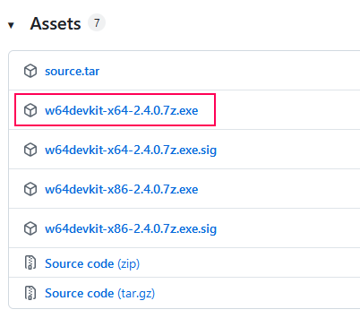
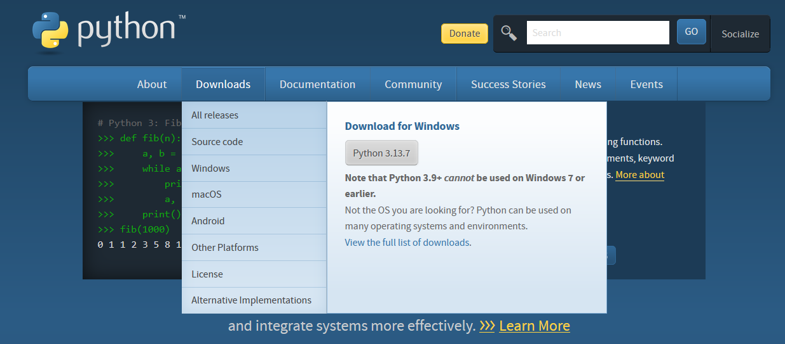

# Windows Prerequisite guide

```text
make a .bat install everything
step by step very explicit

python installator: check pip and env var
```

## w64devkit

1. Go on <https://github.com/skeeto/w64devkit/releases/>.
2. Click on `w64devkit-x64-2.4.0.7z.exe`
   (the version number may be different for you).
   
3. Run the executable.
4. It will prompt you where to extract files.
   You can keep it as default or change it if you want to (i recommand `C:\w64devkit`).
   In any case, copy/memorize the selected folder.
5. In the windows search bar, type `env` and select `Edit the system environment variables`.
6. Click the `Environment Variables...`.
7. In the `System Variables` section, locate `Path`, and click edit.
8. Click the `Browse` button, locate the `w64devkit` folder and select the `bin` folder.
9. Don't forget to click `OK` a few times.

## Python

1. Go on <https://www.python.org/>.
2. In the download tab, click on the download button .
3. Run the executable.
4. Check `Add python to PATH` and click `Install Now`.
5. In the `py` folder, run the `install.bat`

## CC65

1. Go on <https://github.com/cc65/cc65>.
2. Scroll to the bottom of the page and click on the download link for "Windows 64bit".
3. Extract the archive to a location of your choice.
4. In the windows search bar, type `env` and select `Edit the system environment variables`.
5. Click the `Environment Variables...`.
6. In the `System Variables` section, locate `Path`, and click edit.
7. Click the `Browse` button, locate your cc65 folder and select the `bin` folder.
8. Don't forget to click `OK` a few times.

## Emulator

See [this section](../../README.md#emulators).
But if short:

1. Go on <https://www.mesen.ca/>.
2. Click the Download button.
3. Extract the archive to a location of your choice.
